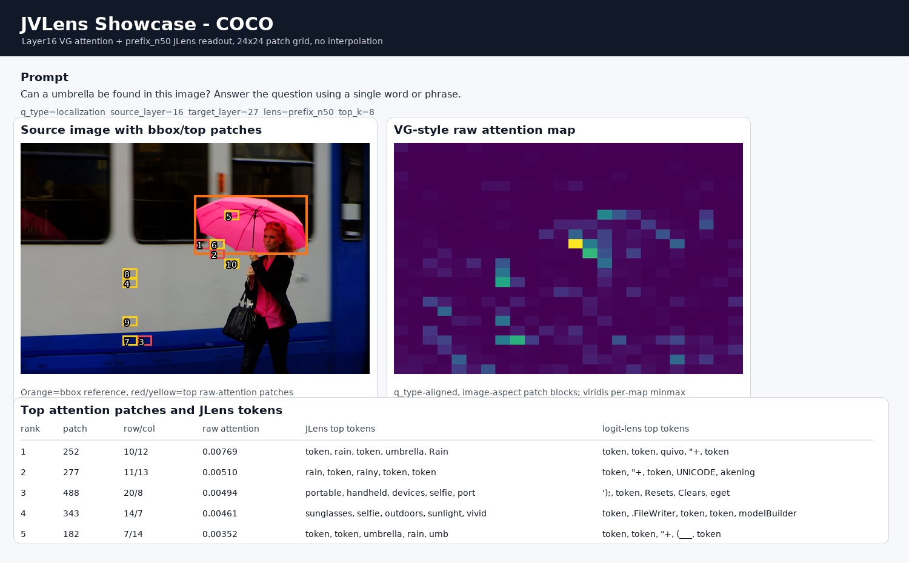
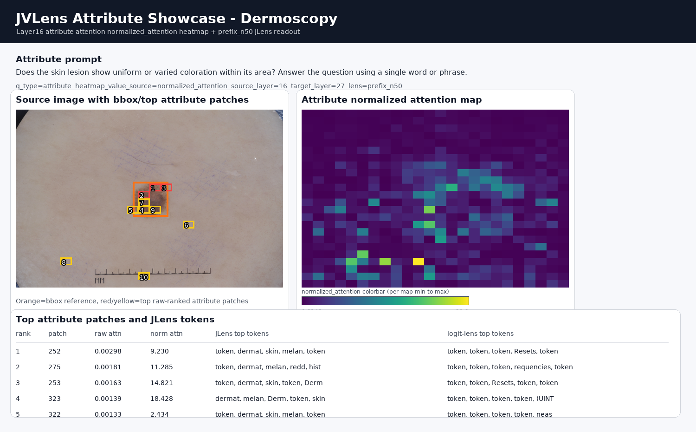
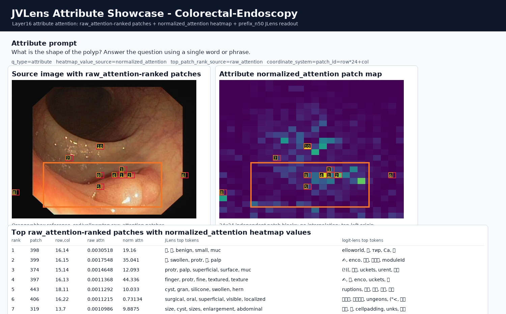

# JVLens 开源预备版本

[English README](README.md)

JVLens 是一个单图像可视化工具，用于在同一份静态报告中联合展示两类信息：

- VG 风格的 24x24 图像 token 网格注意力图。
- top attention patch 的 JLens readout token，并提供 logit-lens baseline 作为对照。

这个目录是用于开源审查的 staging package，包含源码、文档、schema、合成 fixture demo，以及 layer16 n50 的 JLens 拟合矩阵。它不包含 HuatuoGPT-Vision 模型权重、本地缓存路径或真实数据集原图。

## 展示样例

这些展示图来自已验证的 layer16 VG/JLens 对齐产物，并经过静态脱敏处理。当前展示使用 `attribute_raw` 模式：即 attribute prompt、`raw_attention` 注意力图、以及按 `raw_attention` 排序的 top patch。

右侧 attention map 只显示 `raw_attention` heatmap 和 bbox，不再绘制 top patch 框或 rank 编号；top patch 的 rank 信息保留在左侧原图和下方 10 行表格中。

preview PNG 的文字使用支持 CJK 的 fallback 字体渲染，中文 readout token 会原样显示；仓库不打包字体文件，也不记录本地字体绝对路径。

### COCO



自然图像示例，使用 attribute prompt、layer16、prefix_n50 JLens，以及 24x24 raw attention patch grid。

### Dermoscopy



皮肤镜病灶示例，使用 attribute prompt、layer16、prefix_n50 JLens，以及 24x24 raw attention patch grid。

### Colorectal-Endoscopy



结直肠内镜息肉示例，使用 attribute prompt、layer16、prefix_n50 JLens，以及 24x24 raw attention patch grid。

## 状态

本 staging package 使用 MIT License。HuatuoGPT-Vision 上游模型权重和支持代码仍属于外部资产，受其各自许可证和模型条款约束。

## 安装

建议使用 Python 3.11 或更新版本。创建环境后安装最小依赖：

```bash
pip install -r requirements.txt
```

如果需要运行真实模型，还需要安装 HuatuoGPT-Vision 支持代码，以及本地 Huatuo adapter 所需的 JLens runtime 依赖。

## 无模型静态 fixture 命令

下面的 fixture 和校验命令只是静态校验路径。它们不会加载 HuatuoGPT-Vision，不会执行 forward，也不会重新计算 VG attention，因此不能表示完整 JLens/VG pipeline 可以在无模型环境中运行。对用户新输入图像生成真实 JLens+VG 结果，需要走模型运行路径，并使用合适的 GPU 环境。

查看 CLI 帮助：

```bash
PYTHONDONTWRITEBYTECODE=1 python run_jvlens.py --help
```

验证内置无模型合成 fixture：

```bash
PYTHONDONTWRITEBYTECODE=1 python run_jvlens.py validate-output --out-dir examples/fixture_demo
```

生成一个无模型合成 fixture：

```bash
PYTHONDONTWRITEBYTECODE=1 python run_jvlens.py make-fixture-demo --out-dir experiment/fixture_demo_local --overwrite
```

## 真实单图运行模板

真实模型执行带有显式安全开关。没有 `--allow-model-run` 时，`run-single` 会快速失败，不会加载模型。

```bash
PYTHONDONTWRITEBYTECODE=1 python run_jvlens.py run-single \
  --image /path/to/image.png \
  --prompt "What visual evidence supports the answer?" \
  --vg-attention-mode attribute_raw \
  --model-path /path/to/HuatuoGPT-Vision-7B \
  --support-repo /path/to/HuatuoGPT-Vision \
  --runtime-root /path/to/runtime-adapters \
  --lens-path weights/huatuo_jimage_lens_layer16_n50.pt \
  --out-dir experiment/my_single_image_run \
  --device cuda:0 \
  --allow-model-run
```

## 需要用户自行提供的外部资产

用户需要自行准备：

- HuatuoGPT-Vision-7B 模型文件。
- Huatuo 上游支持仓库。
- 本仓库提供的 layer16 n50 JLens 权重，或满足相同 contract 的替代权重。详见 `weights/README.md`。

## 安全开关

`run-single` 必须显式提供 `--allow-model-run` 才会导入真实 runtime bridge 并加载模型/GPU 依赖。这样可以保证文档审查、fixture 校验等命令停留在无模型静态路径；真实用户图像运行仍需要模型执行。

## 可选拟合与 F1 评估

本 package 也包含可选的 Huatuo JLens 拟合与 token-level F1 评估脚本：

- `scripts/fit/huatuo_fit_jlens.py`
- `scripts/eval/huatuo_eval_fitted_lens.py`
- `scripts/eval/huatuo_single_sample_f1.py`

这些脚本用于复现审查，不包含模型权重、训练数据或自动实验启动器。拟合输出必须显式指定 `--out-dir`，例如 `runs/fit_layer16_n50`。默认 F1 规则是 `sec9_raw`，对应作者风格的 word-bag metric；`medical_extended` 作为可选扩展保留。

详见 `docs/fitting.md` 和 `configs/fit_huatuogpt_v7b_layer16_n50.yaml`。

## 可视化约束

默认 VG attention 模式是 `attribute_raw`。可以通过 `--vg-attention-mode` 在四种固定模式中选择：

- `attribute_raw`：`q_type=attribute`，`value_source=raw_attention`
- `attribute_normalized`：`q_type=attribute`，`value_source=normalized_attention`
- `localization_raw`：`q_type=localization`，`value_source=raw_attention`
- `localization_normalized`：`q_type=localization`，`value_source=normalized_attention`

attention map 与 `q_type` 对齐，并按照图像宽高比例渲染为独立 patch blocks：

- 逻辑网格：24x24
- 显示模式：`patch_grid_image_aspect`
- colormap：viridis
- 每张图单独做 minmax 显示
- token 间不插值
- 每个 patch block 独立渲染

详见 `docs/visualization_contract.md`。

## 限制

本 staging package 不声明官方 HuatuoGPT-Vision 支持。它是研究用途的可视化工具，在新模型、新 prompt 或新 lens 权重上使用前，应在目标环境中重新验证。

## 引用与参考

- HuatuoGPT-Vision official: https://github.com/FreedomIntelligence/HuatuoGPT-Vision
- JLens: https://huggingface.co/kieraisverybored/jlens-qwen3.5-27b
- VG / Medical-MLLMs-Fail: https://github.com/Guimeng-Leo-Liu/Medical-MLLMs-Fail
